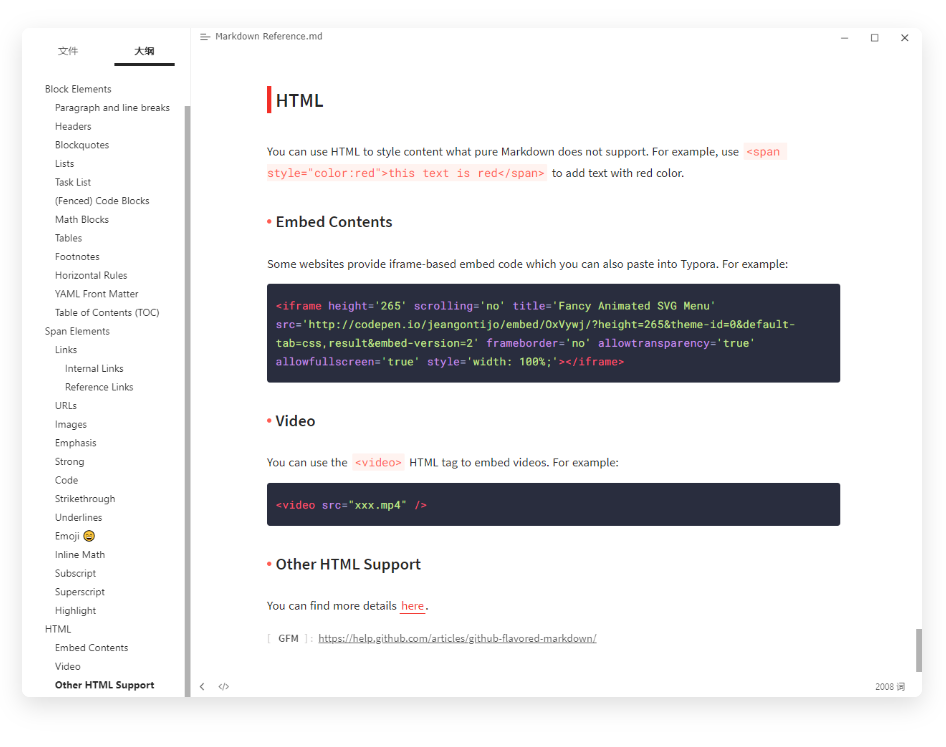
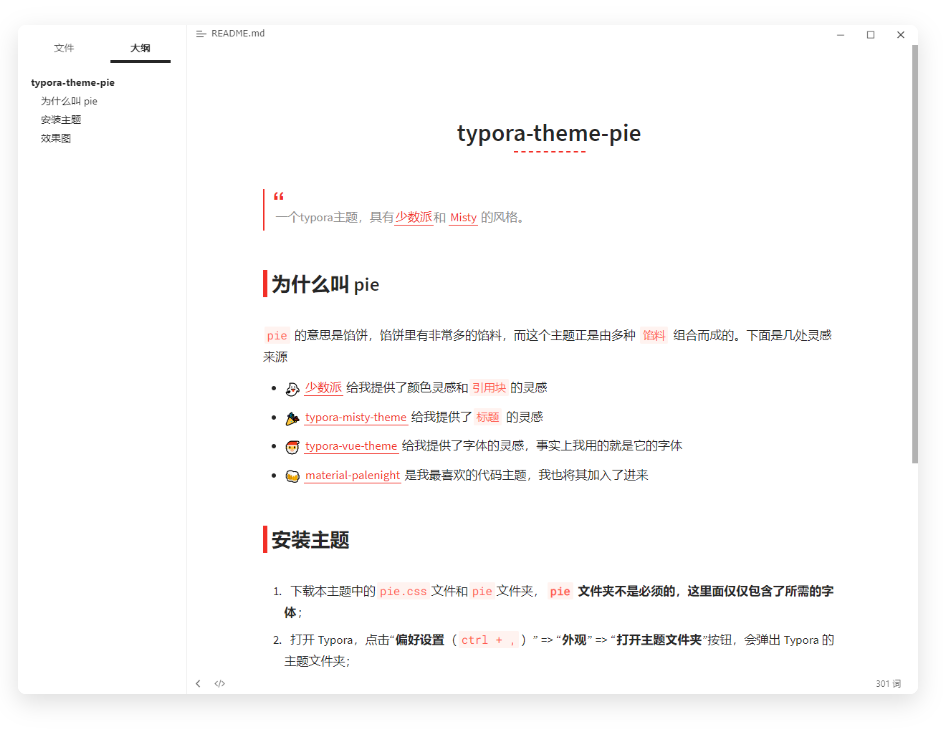

# typora-theme-pie
> A `typora` theme with [sspai.com](http://www.sspai.com) and [Misty](https://github.com/etigerstudio/typora-misty-theme) style.

English | [简体中文](./README_CN.md)

## Why `pie`

There are a lot of fillings in the `pie`, and this theme is made up of a variety of `fillings`. Here are a few inspirations, thank you in advance

- :ghost: [sspai.com](http://www.sspai.com) gave me inspiration for color and `blockquote` 
- :tada: [typora-misty-theme](https://github.com/etigerstudio/typora-misty-theme) gave me inspiration for the `title` 
- :santa: [typora-vue-theme](https://github.com/blinkfox/typora-vue-theme)  provided me with inspiration for `fonts`, in fact I use the fonts it uses
- :beers: [material-palenight](https://codemirror.net/theme/material-palenight.css) is my favorite code theme, and I have also included it

## Install theme

1. Download the `pie.css` file and `pie` folder in this theme. **The `pie` folder is not necessary, it only contains the required fonts;**
2. Open Typora, click "**Preferences** `(ctrl +,)`" => "**Appearance**" => "**Open Theme Folder**" button, the theme folder of Typora will pop up;
3. Put the downloaded `pie.css` and `pie` folders into the theme folder of Typora;
4. Close and reopen Typora, select "**Theme**" => "**Pie**" from the menu bar.

## Effect map

